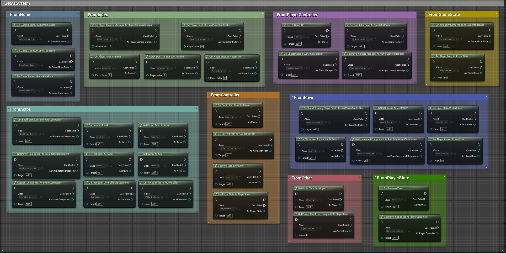

# GetAs system

!!!
The GetAs system is a simple overload of all the getter functions in Unreal Engine that allows you to specify the return class to avoid having to cast the result of the cast every time. All the provided getters are available in both pure (outside the execution thread) and impure (within the execution thread) versions. This page list all implemented getters.
!!!

## Implemented getters list

==- From None - 3
- Get game state as
- Get game instance as
- Get game mode as
==- From Player index - 5
- Get player controller as
- Get player character as
- Get player camera manager as
- Get player pawn as
- Get player state as
==- From AActor - 9
- Get owner as
- Get parent actor as
- Get parent component as
- Get AIController as
- Get blackboard as
- Get instigator controller as
- Get root component
- Get instigator as
- Get level as
==- From Controller - 4
- Get player state as
- Get current path as
- Get view target as
- Get controlled pawn
==- From Player Controller - 4
- Get HUD as 
- Get spectator pawn as
- Get player camera manager as
- Get cheat manager as
==- From Pawn - 6
- Get player state as
- Get controller as
- Get local viewing player controller as
- Get movement component as
- Get movement base actor as
- Get last hit by as
==- From Game state - 6
- Get authority game mode as
- Get player array as
==- From Player state - 2
- Get player controller as
- Get pawn as
==- From Other - 2
- Get player state from unique net id
- Get outer object as
===

!!!success Missing one?
Have you found a getter that is not implemented? <a href= "https://discord.gg/8qeGBsw7gn" target="_blank">Join our discord</a> and contact us ! 
!!!

## Dynamic cast

The Dynamic Cast node works just like the native CastTo node in Unreal Engine, with the difference being that it allows you to change the target class without having to replace the node. It's simple and effective.

[!embed Powered by <a href="https://blueprintue.com" target="_blank">Blueprintue.com</a>.](https://blueprintue.com/render/ki1qpxva/)