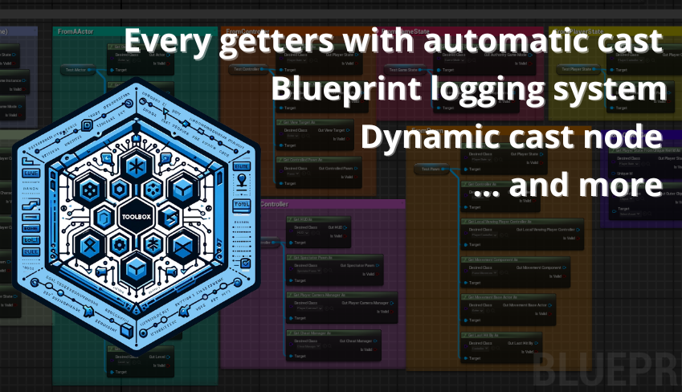
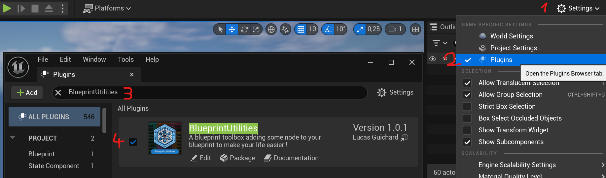

# Blueprint Utilities

||| Details
Plugin version: v1.0.1  
Last documentation update: 03/20/2024  
|||

!!! success Download and activate the BlueprintUtilities
You can simply activate it from the Plugins page ` Settings -> Plugins -> BlueprintUtilities `.

!!!
