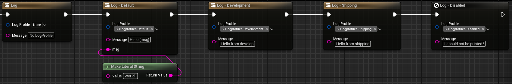

# Logging system

The logging system of BlueprintUtilities allows you to get rid of all the print string/print text in your project. Thanks to its centralized management in the project settings, you can control all your Log nodes at once. This new system also allows you to bring the power of C++ logs into your blueprint code, enabling you to create logs compatible with shipping builds without leaving blueprint.

## Log profiles

To use this system properly you need to create some `Log profiles`. Log profiles represent a logging behavior that you want to use in your project. Log profiles are represented by a name and a `FGameplayTag` to allow you to assign them to each of your blueprint nodes with one click! 


Attribute   | Type | Description
:---   | :---: | ---:
Name | Fname  | Human readable identifier used to make it simple for you to find a profile in settings. Also used to log it in error/warning's message.
Identifier | FGameplayTag | Identifier used to bind a log profile to a Log node.
Color | FColor | Color of the message if the `Print to Screen` is enabled.
Log Permission | EBULogPermission| Define where the log node is authorised to log or not. It is based on the **`who can do more, can do less`** pattern. It means that if you select Shipping it will print in Shipping, development and editor. :icon-stop: To enable log in shipping refer to the [Log in shipping](#log-in-shipping) section
Verbosity | ELogVerbosity | The verbosity to use for the message if the `Print to Log`is enabled.
Print to Log | Bool | Whether to print or not the message to the logs.
Print to Screen | Bool | Whether to print or not the message to the screen. :icon-stop: Ignored in shipping
Prefix | FString | String to add before the message to log.
Suffix | FString | String to add after the message to log.


### Log in shipping

!!!danger Danger zone
Before enable log in shipping, ensure you are aware of what your doing. Log in shipping can lead to severe data leaks.
!!! 

To log in shipping you need to use an Unreal Engine version `From source`. *See : [Unreal Engine from source documentation](https://docs.unrealengine.com/5.3/en-US/downloading-unreal-engine-source-code/)*. Then in your project’s Target.cs file add the following lines to force enable the log in shipping.

```cpp #8-9 PROJECT/Source/PROJECT.Target.cs
public class PluginSandboxProjectTarget : TargetRules
{
	public PluginSandboxProjectTarget(TargetInfo Target) : base(Target)
	{
		Type = TargetType.Game;
		DefaultBuildSettings = BuildSettingsVersion.V4;
		
		BuildEnvironment = TargetBuildEnvironment.Unique;
		bUseLoggingInShipping = true;

		ExtraModuleNames.AddRange( new string[] { "PluginSandboxProject" } );
	}
}
```


### Example

Once you have finished setting up your log profiles, all that's left is to use the Log node in your project. Easy, isn't it? :stuck_out_tongue_winking_eye:

[!embed Powered by <a href="https://blueprintue.com" target="_blank">Blueprintue.com</a>.](https://blueprintue.com/render/5qfp2-lv/)