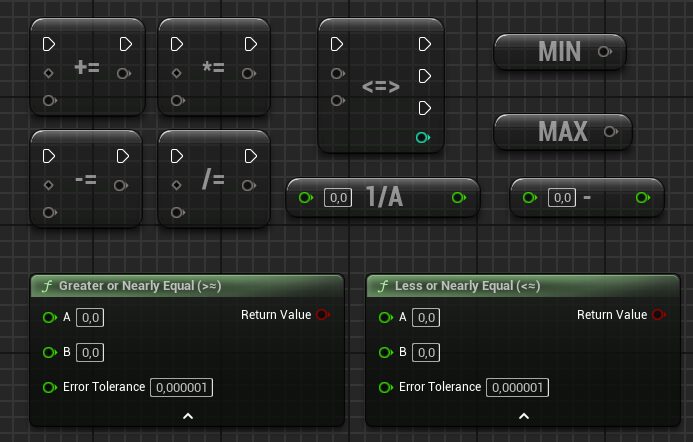
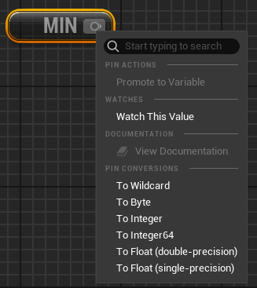
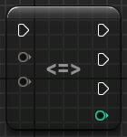
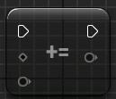
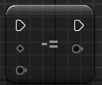
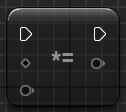
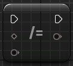
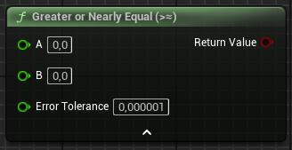
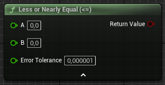

# Math library

!!!
The math library of Blueprint Utilities provides new nodes to simplify scripting complex operations. The main goal of this library is to consolidate frequently used operations, such as the
$$ \frac{1}{x} $$
function, into a single node, without duplicating native Unreal Engine nodes.
!!!

## Node list

==- MIN

The `MIN` node return the smallest value of the selected type.

### Ouput

Value [!badge variant="ghost" text="Wildcard"]
:   Return the smallest value of the selected type.

    *:icon-info: Right click on this pin to select manualy the type of the node. (see screen above)*

==- MAX

The `MAX` node return the highest value of the selected type.

### Ouput

Value [!badge variant="ghost" text="Wildcard"]
:   Return the highest value of the selected type.

    *:icon-info: Right click on this pin to select manualy the type of the node. (see screen above)*

==- Oposit

The `Oposit (-)` node return the input value times -1.

### Input

A [!badge variant="ghost" text="Double: 0.0d"]
:    The value to compute

### Ouput

Value [!badge variant="ghost" text="Double"]
:   The result of $$ A \times -1 $$

==- Invert

The `Invert (1/x)` node return 1 devided by the input value.

### Input

A [!badge variant="ghost" text="Double: 0.0d"]
:    The value to compute.
    
    *:icon-alert: If A is `0` then the node return `0` and raise and division error.*

### Ouput

Value [!badge variant="ghost" text="Double"]
:   The result of $$ \frac{1}{A} $$

==- Spaceship operator

The `Spaceship Operator <=>` is the same as the operator from Perl, Ruby and C++20. <a href="https://en.wikipedia.org/wiki/Three-way_comparison#:~:text=Spaceship%20operator,-The%20three%2Dway&text=The%20name's%20origin%20is%20due,in%20the%20Star%20Wars%20saga." target="_blank">Full explenation on the wikipedia page</a>

### Input 

Exec [!badge variant="ghost" text="execution"]
:   Main input pin of the node

A [!badge variant="ghost" text="Wildcard"]
:   The first value to use in the three ways comparaison operator.

B [!badge variant="ghost" text="Wildcard"]
:   The second value to use in the three ways comparaison operator.

### Ouput

Less [!badge variant="ghost" text="execution"]
:   Ouput pin triggered when `A < B`.

Equal [!badge variant="ghost" text="execution"]
:   Ouput pin triggered when `A == B`.

Greater [!badge variant="ghost" text="execution"]
:   Ouput pin triggered when `A > B`.

Result [!badge variant="ghost" text="int"]
:   Result value of the operator returned to allow the user to use it without creating a new tempoary variable.

==- Plus equal operator

The `+=` node behave like the C++ += operator. It take the B value and add it to A and set the new value to the variable A: `A += B` = `A = A + B`.

### Input 

Exec [!badge variant="ghost" text="execution"]
:   Main input pin of the node.

A [!badge variant="ghost" text="Wildcard (by Ref)"]
:   Reference to the variable you want to update.

B [!badge variant="ghost" text="Wildcard"]
:   The value used as right-value in the operation.

### Ouput

Then [!badge variant="ghost" text="execution"]
:   Ouput execution pin.

Value [!badge variant="ghost" text="Wildcard"]
:   The new value of `A` after the assignment. Same as a fresh new get.

==- Substract equal operator

The `-=` node behave like the C++ -= operator. It take the B value and substract it to A and set the new value to the variable A: `A -= B` = `A = A - B`.

### Input 

Exec [!badge variant="ghost" text="execution"]
:   Main input pin of the node.

A [!badge variant="ghost" text="Wildcard (by Ref)"]
:   Reference to the variable you want to update.

B [!badge variant="ghost" text="Wildcard"]
:   The value used as right-value in the operation.

### Ouput

Then [!badge variant="ghost" text="execution"]
:   Ouput execution pin.

Value [!badge variant="ghost" text="Wildcard"]
:   The new value of `A` after the assignment. Same as a fresh new get.

==- Multiply equal operator

The `*=` node behave like the C++ *= operator. It take the B value and multiply with A and set the new value to the variable A: `A *= B` = `A = A * B`.

### Input 

Exec [!badge variant="ghost" text="execution"]
:   Main input pin of the node.

A [!badge variant="ghost" text="Wildcard (by Ref)"]
:   Reference to the variable you want to update.

B [!badge variant="ghost" text="Wildcard"]
:   The value used as right-value in the operation.

### Ouput

Then [!badge variant="ghost" text="execution"]
:   Ouput execution pin.

Value [!badge variant="ghost" text="Wildcard"]
:   The new value of `A` after the assignment. Same as a fresh new get.

==- Devide equal operator

The `/=` node behave like the C++ /= operator. It take the A value and devide it with B and set the new value to the variable A: `A /= B` = `A = A / B`.

### Input 

Exec [!badge variant="ghost" text="execution"]
:   Main input pin of the node.

A [!badge variant="ghost" text="Wildcard (by Ref)"]
:   Reference to the variable you want to update.

B [!badge variant="ghost" text="Wildcard"]
:   The value used as right-value in the operation.

### Ouput

Then [!badge variant="ghost" text="execution"]
:   Ouput execution pin.

Value [!badge variant="ghost" text="Wildcard"]
:   The new value of `A` after the assignment. Same as a fresh new get.

==- Greater or Nearly Equal

The `Greater or Nearly Equal >≈` node return true if the A is superior to B or is nearly equal to B (using the error tolerance value): `A >≈ B is same as A > (B - ErrorTolerance)`

### Input 

A [!badge variant="ghost" text="Double"]
:   The value that will be compared.

B [!badge variant="ghost" text="Double"]
:   The value `A` will be compared to.

Error Tolerance [!badge variant="ghost" text="Double"]
:   The precision value is used to determine if A is considered equal to B.

### Ouput

Return Value [!badge variant="ghost" text="Bool"]
:   True if `A >≈ B`.

==- Less or Nearly Equal

The `Less or Nearly Equal <≈` node return true if the A is less than B or is nearly equal to B (using the error tolerance value): `A <≈ B is same as A < (B + ErrorTolerance)`

### Input 

A [!badge variant="ghost" text="Double"]
:   The value that will be compared.

B [!badge variant="ghost" text="Double"]
:   The value `A` will be compared to.

Error Tolerance [!badge variant="ghost" text="Double"]
:   The precision value is used to determine if A is considered equal to B.

### Ouput

Return Value [!badge variant="ghost" text="Bool"]
:   True if `A <≈ B`.

===
