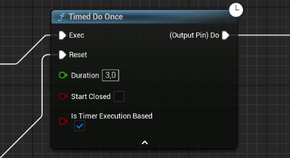

# Workflow library

!!!
Workflow library of the BlueprintUtilities plugin is containing a list of node that help you to improve your blueprint workflow. 
!!!

==- Timed Do Once

The `Timed Do Once` node behave like the vanilla `Do Once` node except it allows you to give a duration after which the node will be automatically "unlock".

### Input 

Exec [!badge variant="ghost" text="execution"]
:   Main input pin of the node. Used to triger the `Do` output execution pin.

Reset [!badge variant="ghost" text="execution"]
:   Alternative input pin used to manualy "unlock" the node allowing you to trigger the `Do` output execution pin again. If the timer is running it will be stop and clear.

Duration [!badge variant="ghost" text="float:1.0f"]
:   The perdiod to wait before "unlicking" the node.

StartClosed [!badge variant="ghost" text="bool: false"]
:   If true, the node will reject the first execution. :icon-stop: The first execution will start the timer.

IsTimerExecutionBased [!badge variant="ghost" text="bool: true"]
:    - If true, the timer will start only after execution until it "unlock"the node or being manually reset and will be auto-cleared after the node "unlocked".
     - If failse, the timer will run continuouslly and will "unlock"the node each time it reach the `Duration`.

### Ouput

Do [!badge variant="ghost" text="execution"]
:   Ouput pin triggered when the `Exec` input pin is triggered and the node is open.

===