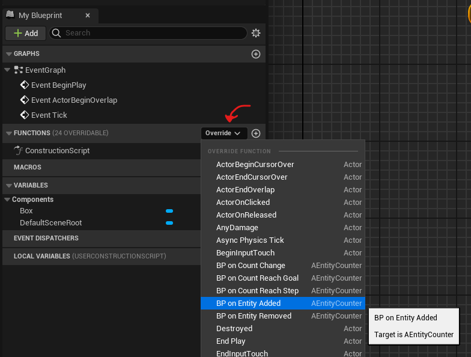
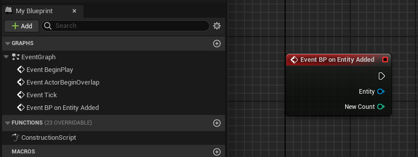

# Counter's events

The `ECEntityCounter` class has 4 events replicated to all clients (server authoritative). These four events are public and can be used from C++ code or from Blueprint.

!!!warning
Some events are only propagated if the counter's configuration allows it. See [Counter's configuration (Steps and Goals)](CountersConfigurations.md)
!!!

## Events

- **OnEntityAdded** (AActor* NewEntity, int32 NewCount): Fired every time an entity is added to the count.
- **OnEntityRemoved** (AActor* RemovedEntity, int32 NewCount): Fired every time an entity is removed from the count.
- **OnCountReachStep** (int32 Step): Fired when the counter reaches a step and gives the step value as parameter.
- **OnCoutReachGoal** (): Fired when the counter reaches the goal.

## Bindings

+++ Blueprint

To easily bind your events in your blueprint actor you can use the blueprint implementable version of the event. 
To do so, on the right side of the FUNCTIONS section, click on `override` and select the event you want to implement.



Once clicked it will generate the blueprint nodes allowing you to implement this event in your actor. 
 


!!!secondary
Sometimes it will generate a function instead of an event. In this case, simply right-click on the function node and select “convert to event”.
!!!

+++ C++
In C++ code, just get your EntityCounter actor and bind a callback to the public delegate associated with the event you need.

```cpp #2-3
AECEntityCounter* EntityCounter = ... // Get a reference to the counter you want yor code to bind to
EntityCounter->OnEntityAdded.AddDynamic(this, &APSPlayerCharacter::OnEntityDetected);
EntityCounter->StartDetection();
```
+++