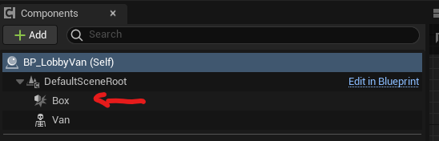

# Parents classes

To quickly start using the plugin, create an actor with a shaped parent class. See the following [Shaped counters section](#shaped-class). This will save you from having to unnecessarily manipulate the construction scripts. Either using a [Shaped-counter](#shaped-class) or the [Generic-counter](#generic-counters), you can create a blueprint or c++ actor from these classes.

## Shaped class
!!!
Shaped counter’s class are child classes of `ECEntityCounter` that manipulate the construction script for you by adding a shape component as trigger area and set his collision response accordingly. This will allow you to directly use your counter without going through the construction script stage.
!!!

There is three shaped classes :

**ECCubicEntityCounter**
:   A counter with a `BoxComponent` as trigger zone.

**ECCapletEntityCounter**
:   A counter with a `CapsuleComponent` as trigger zone.

**ECSphericalEntityCounter**
:   A counter with a `SphereComponent` as trigger zone.


## Generic counters

Using the `ECEntityCounter`, you will be able to use any type of ShapeComponent as trigger zone ([!badge variant="dark" text="even custom one you created"])! <br>
To do so : add a component inheriting from the class UShapeComponent (UBoxComponent, USphereComponent, UYourCustonShape, YourCustomShapeComponent, ...).




Then call the `SetUpCounter` metod in your construction script by passing the reference to your component to the method.

[!embed Powered by <a href="https://blueprintue.com" target="_blank">Blueprintue.com</a>.](https://blueprintue.com/render/lamaq2g_/)

.. Or in the same way in C++ constructor method :

```cpp #3,10-11
// LobbyVan.h
protected:
  TObjectPtr<UBoxComponent> Box;
//...

// LobyVan.cpp
PSLobbyVan::PSLobbyVan()
{
  //...
  Box = CreateDefaultSubobject<UBoxComponent>(TEXT("Box"));
  SetUpCounter(Box);
  //...
}
```

!!!
This component will represent the area in which entities are counted. (This area will be called the trigger zone for the rest of this documentation)
!!!
