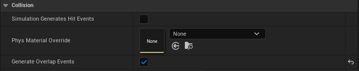
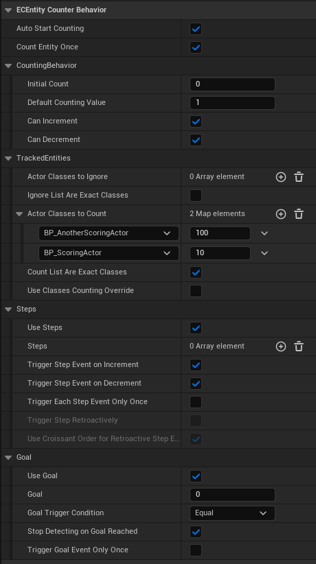

# Counter's configuration

!!!danger Counted class configuration 
Before any counter configuration, don’t forget to enable the **Generate overlap event** on each counted class or your counter will never trigger an overlap event with them (see image below). Once it’s done, let’s talk about counter configuration …

!!!

The `ECEntityCounter` class offers a whole range of parameters allowing you to modify the behavior of the counter. All of these parameters are marked as **EditAnywhere**, so you can configure your counter in your main Blueprint class or individually in each of the instances placed in the world. All parameters can be changed at runtime without restarting the counter.

!!!warning
In this section, I suggest you to pay attention to the logic you want to implement. Some combinations of parameters can sometimes block the counter if you are not careful e.g. : If `CanIncrement` and `CanDecrement` are false, the counter will never change… 
!!!

Here is the full list and details about each parametters :

==- Global Parameters :

AutoStartCounting [!badge variant="ghost" text="Bool: true"]
:   If true, the counter will start detection right after the `SetUpCounter` if the actor is in game or it will wait for the BeginPlay.

CountEntityOnce [!badge variant="ghost" text="Bool: true"]
:   If true, the counter will count the entity only once, else, it will count the entity each-time it enters the trigger zone.. 
    → *details : if `CanDecrement` is true and the entity leaves the trigger zone, it will be removed from the list and it will count again if it crosses the trigger zone another time.*

==- Counting behavior parameters:

InitialCount [!badge variant="ghost" text="Int32: 0"]
:   The initial value of the counter.

DefaultCountingValue [!badge variant="ghost" text="Int32: 1"]
:   The value used to increment or decrement the counter for each entity by default.

CanIncrement [!badge variant="ghost" text="Bool: true"]
:   If true, the counter will increment if a countable entity enters in the trigger zone.

CanDecrement [!badge variant="ghost" text="Bool: true"]
:   If true, the counter will decrease if a countable entity leaves the trigger zone.

==- Tracked Entities parameters :

ActorClassesToIgnore [!badge variant="ghost" text="TArray<TSubclassOf<AActor>>: Empty"]
:   List of actor’s class to ignore when detecting entities. Leave it empty to ignore nothing.

IgnoreListAreExactClasses [!badge variant="ghost" text="Bool: false"]
:   If true, the overlapping actor class will be tested with an exact match. It means only the exact class will be ignored and not child classes.

ActorClassesToCount [!badge variant="ghost" text="TMap<TSubclassOf<AActor>, int32>: Empty"]
:   Map of actor’s class to count when detecting entities. Leave it empty to count every class. The key represents the class and the value represents the custom increment value used if `UseClassesIncrementOverride` is true.

CountListAreExactClasses [!badge variant="ghost" text="Bool: false"]
:   If true, the overlapping actor class will be tested with an exact match. It means only the exact class will be counted and not child classes.

UseClassesCountingOverride [!badge variant="ghost" text="Bool: false"]
:   If true, the counter will use a custom counting value for each `CountedClasses` stored in the map `ActorClassesToCount` to increment or decrement the count value.

==- Steps parameters:

UseSteps [!badge variant="ghost" text="Bool: false"]
:   If true, the counter will trigger the event `OnCountReachStep` when the counter reaches a step.

Steps [!badge variant="ghost" text="TArray<Int32>: Empty"]
:   List containing each step of this counter.

TriggerStepEventOnIncrement [!badge variant="ghost" text="Bool: true"]
:   If true, the counter will fire the `OnCountReachStep` event if the count reaches a step during an incrementing phase.

TriggerStepEventOnDecrement [!badge variant="ghost" text="Bool: true"]
:   If true, the counter will fire the `OnCountReachStep` event if the count reaches a step during a decrementing phase.

TriggerEachStepEventOnlyOnce [!badge variant="ghost" text="Bool: false"]
:   If true, the counter will fire each step event only once at the first time it reaches the step.

TriggerStepRetroactively [!badge variant="ghost" text="Bool: false"]
:   If true, if the counter skips a step due to an increment (or decrement) it will fire all skipped step events according to the `UserCroissantOrderForRetroactiveStepEvent` variable. 
    → *E.g. The count is 0 and it has the following steps : 5,8,10. If the count gains +10, it will skip step 5 and 8. By allowing this parameter the counter will fire step 5, step 8 and then step 10 on the same frame to prevent you from skipping steps. If you want the same behavior but triggering only Greater steps you must uncheck the `UserCroissantOrderForRetroactiveStepEvent` variable.*

UserCroissantOrderForRetroactiveStepEvent [!badge variant="ghost" text="Bool: true"]
:   If true, retroactive step events will be fired in decreasing order using the current count as lowest step value to fire.

==- Goal parameters:

UseGoal [!badge variant="ghost" text="Bool: false"]
:   If true, the count will fire the `OnCountReachGoal` event when the counter reaches his goal.

Goal [!badge variant="ghost" text="Int32: 0"]
:   The goal value.

GoalTriggerCondition [!badge variant="ghost" text="EECTriggerCondition: Equal"]
:   This parameter specifies the way you want to confront the current count of the counter to the Goal. There is one enum value for each type of test (<, <=, ==, >=, >).

StopDetectingOnGoalReached [!badge variant="ghost" text="Bool: true"]
:   If true, the counter will automatically stop the entity detection when it reaches the goal.

TriggerGoalEventOnlyOnce [!badge variant="ghost" text="Bool: false"]
:   If true, the `OnCountReachGoal` event will fire only the first time it meets the goal.

===