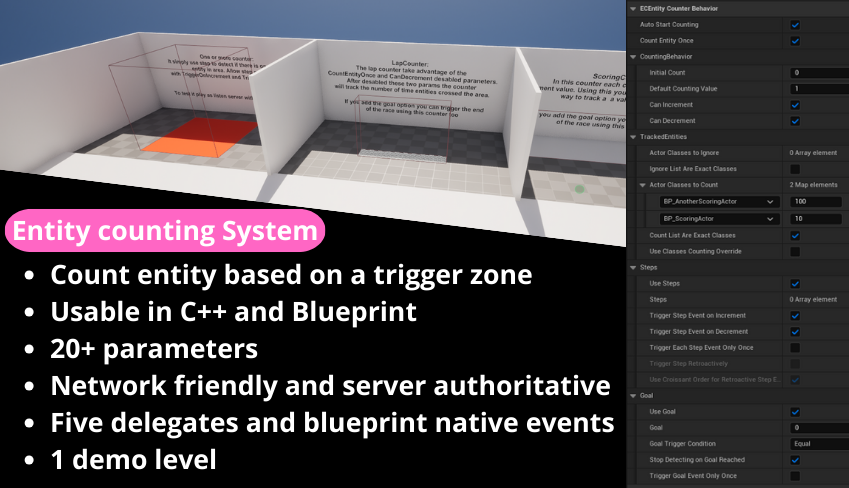
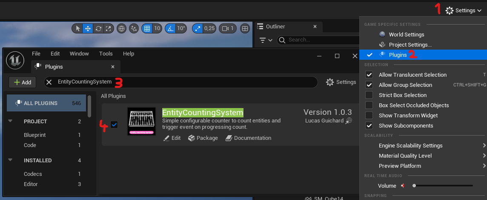

# Entity Counting System

||| Details
Plugin version: v1.0.4<br>
Last documentation update: 01/21/2024<br>
|||

## Plugin activation

+++ Blueprint
To enable the plugin using Blueprint, follows the 4 steps and the restart your editor.

  

+++ C++
To enable the plugin using C++, add the plugin module name in your public dependencies like following the code.

```cpp #4 PROJECT.Build.cs
public PluginSandboxProject(ReadOnlyTargetRules Target) : base(Target)
	{
		//...
		PublicDependencyModuleNames.AddRange(new string[] { ..., "EntityCountingSystem"});
		// ...
	}
```
+++